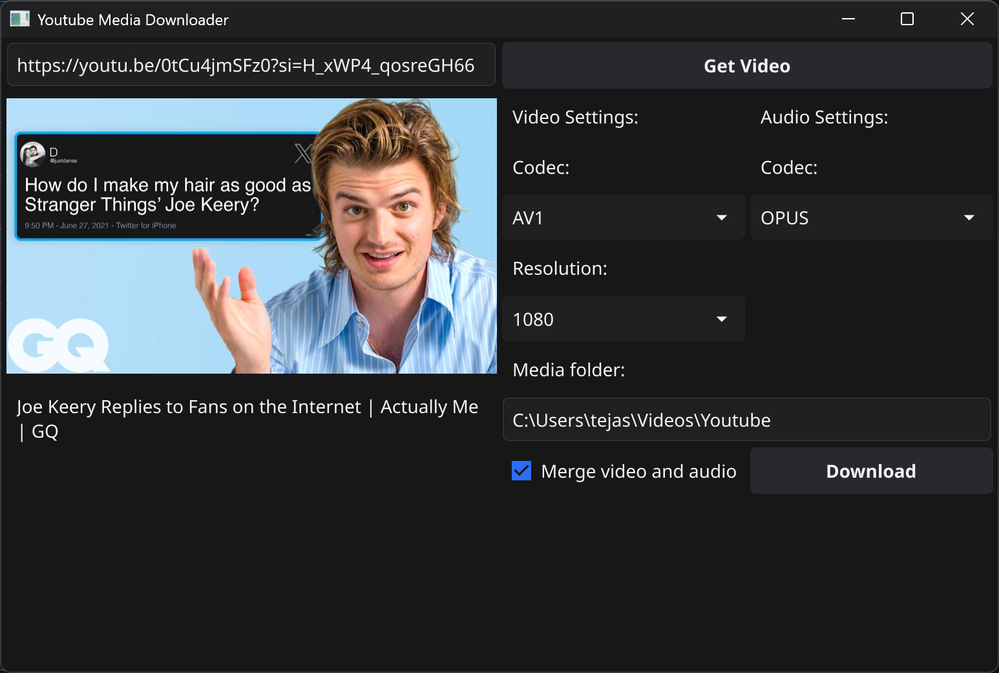

# Build From Source
- Arch Linux:
  ```bash
  sudo pacman -S git base-devel libxrandr libxi libxcursor libxinerama go yt-dlp ffmpeg --noconfirm --needed
  cd ~/Downloads
  git clone https://github.com/TejasPersonal/youtube-media-downloader
  cd youtube-media-downloader
  go mod tidy
  go build -o bin/

  # run
  bin/youtube-media-downloader
  ```
